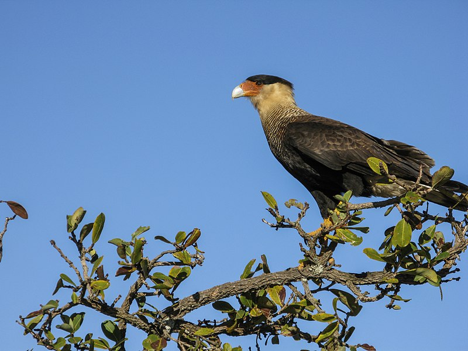
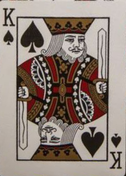
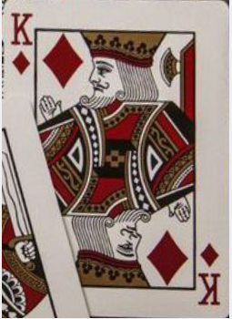
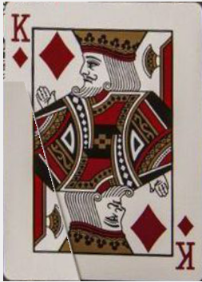

# Desafio de Visão Computacional
repo-name: **desafio-visao-computacional**

## Objetivo

Este repositório tem o objetivo de armazenar a solução do desafio de visão computacional proposto no Centro de Competência em Robótica do SENAI CIMATEC.

## Desafio

O desafio consiste em realizar transformações em determinada imagem, de modo que as cartas presentes nesta imagem sejam apresentadas na forma retangular e sem oclusão.


## Material de Apoio

Na solução do desafio foi utilizado um material de apoio feito por outros bolsistas deste mesmo centro de competência. Este material pode ser encontrados nos seguintes links.

- [Link do Minicurso do RoSA](https://github.com/Brazilian-Institute-of-Robotics/bir-mini-robotic-vision/tree/presentation)
- [Google Coolab do Mini-curso](https://colab.research.google.com/drive/1ozEWpFhsqHC6vI3QS-IxH6HThysonxKq)


## 1 - Preparação

Antes de trabalhar na solução é importante preparar um ambiente virtual, pois isto permite que a instalação de bibliotecas necessárias para aplicação não sejam instaladas no âmbito global do sistema.
O pacote escolhido para esta função é o [Venv](https://docs.python.org/3/library/venv.html) e sua instalação segue os seguintes passos:

- Instalação do Pip
- Instação do Virtualenv e criação do ambiente virtual
- instalação de pacotes no ambiente do Venv

### Instalação do Pip

Utilizarei o **Ubuntu 20.04** juntamente com o Python 3 para este trabalho, sendo este último já pré-instalado no sistema. Portanto, só é necessário instalar o **pip**, gerenciador de pacotes do Python. A instalação ocorre ao executar os seguintes comandos no terminal:

```console
sudo apt update
sudo apt -y upgrade
sudo apt-get install python3-pip
```
### Instalação do Virtualenv e Criação do Ambiente

Utilizando o **pip** é simples instalar o Venv, bastando somente executar os seguintes comandos no terminal:

```console
pip3 install virtualenv
apt install python3.8-venv
```

No Unbuntu 20.04 o pacote do venv esta associado ao Python3.8, mas a versão pode ser diferente em outras distribuições.

Dentro da pasta que deseja criar o ambiente virtual execute o seguinte comando de terminal:
```console
python3 -m venv .venv
```
Dara ativar o ambiente basta utilizar o  seguinte comando:
```console
source .venv/bin/activate
```
Se tudo ocorreu bem, deverá aparecer o nome do ambiente, (.venv) antes do nome do usuário.


Para finalizar o processo é necessário apenas instalar uma extensão do VS Code que ativa automaticamente o ambiente virtual. A extensão a ser instalada é a [Python Auto Venv](https://marketplace.visualstudio.com/items?itemName=whinarn.python-auto-venv) e estará automaticamente ativa ao reiniciar o VS Code. Na interface do VS Code aparecerá versão do Python e o nome do ambiente, no canto inferior esquerdo:


## 2 - Instalação de Pacotes no Ambiente do Venv

Antes de utilizar funções básicas do OpenCV será necessário instalar alguns pacotes no ambiente virtual, dentre estes: [numpy](https://numpy.org/), uma biblioteca numérica, [scikit-image](https://scikit-image.org/), para utilizar imagens diretamente da internet, e [opencv](https://opencv.org/). Nesta instalação será utilizada novamente o pip, mas agora no **ambiente virtual**. Portanto execute:

```console
python -m pip install -U pip
python -m pip install -U numpy
python -m pip install -U opencv-contrib-python
python -m pip install -U scikit-image
```

O flag -m aponta que sera utilizado um módulo de python. Já o flag -U faz com que o pacote seja atualizado, caso já tenha sido instalado.

Para testar a configuração do ambiente rode o seguinte script:
```console
python src/open-cv-first-touch.py
```
e a seguinte imagem deverá aparecer na tela. É possível que o script demore um pouco.




## 3 - Correção de Perspectiva

A principal funcionalidade para  desafio é a correção de perspectiva, portanto, o primeiro passo do nosso processo de solução será esta correção.
Para realizar esta tarefa utilizaremos o script ``perspective_transform.py``, que possui o seguinte código:

```python
#  Autor: Caio Maia - caiomaia3@gmail.com
#  Este script tem o objetivo de experimentar as funções básicas do open-cv
import cv2
import numpy as np
from skimage import io
import card_transformation as ct

imported_image = io.imread("./img/cards.jpg")
imported_image = cv2.cvtColor(imported_image,cv2.COLOR_BGR2RGB)

source_points = np.float32([[111,217],
        [289,184],
	[154,483],
	[355,439]])

cv2.imshow('myImage2',ct.perspective(imported_image,source_points))
cv2.waitKey(0) 
cv2.destroyAllWindows()
```

Na primeira secção do código são realizadas importações das bibliotecas: OpenCV, Numpy, scikit-image. A OpenCV é a biblioteca que mais iremos utilizar, para realizar transformações nas imagens de interesse. A Numpy é um biblioteca numérica para o Python e  que em nosso contexto oferece uma base para o trabalho no OpenCV, pois oferece a estrutura de dado que permite a representação das imagens em forma de array. Já a scikit-image é utilizada para realizar importação de imagens ``.jpg`` no formato de array do Numpy.

Como apenas as funções do Python e das bibliotecas são insuficientes, será utilizado o pacote ``card_transformation.py``, sendo este também importado.

Após a importação da imagem, é instanciada a  variável ``source_points`` contendo um array com os pontos que definem a região em que será realizada a transformação. Estes pontos são 
 pares ordenados com a localização do pixel associado a imgagem.

```python
source_points = np.float32([[111,217],
        [289,184],
	[154,483],
	[355,439]])
```
Na imagem a seguir está marcada a localização destes pontos delimitantes.


Vale ressaltar a importância da sequência dos pontos no array, que possuem a seguinte disposição na imagem.

```python
# 1 ---- 2
# |      |
# |      |
# |      |
# 3 ---- 4
```

Do pacote ``card_transformation`` utilizaremos o método ``perspective``, que utilizará a marcação anterior na correção de perspectiva.

```python
def perspective(input_image,source_points):
	## Define card size and position
	card_height = 350
	card_width  = 250

	start_point = [0,0]
	end_point   =[card_width,card_height]

	destination_points = np.float32([start_point,
				[card_width,0],
				[0,card_height],
				end_point])

	transformation_matrix = cv2.getPerspectiveTransform(source_points,destination_points)
	output_image = cv2.warpPerspective(input_image,transformation_matrix,(card_width,card_height))
	return output_image
```

No método ``perspective`` são definidos a proporcionalidade da imagem final e os pontos que definirão esta nova imagem. Em seguida é calculada a matriz de transformação entre as duas regiões, para finalmente aplicar o método  ``.warpPerspective()`` na ``input_imagem``, que retorna  a imagem transformada ``output_image``.

Ao executar o script ``perspective_transform.py`` a seguinte imagem do Rei de Espadas é mostrada na tela, sendo retirada e corrigida a partir da foto original ``./img/cards.jpg``:



## 4 - Correção da Oclusão

 A estratégia utilizada para resolver o problema da oclusão será a utilização da simetria da carta. Portanto a ideia é primeiramente realizar a correção de perspectiva e em seguida compor uma imagem com partes da carta original.

O código abaixo apresenta extração do Rei de Espadas e do Rei de Ouros.

```python
#  Autor: Caio Maia - caiomaia3@gmail.com
#  Este script tem o objetivo de resolver um desafio proposto no Centro de Competência em Robótica e Sistemas Autônomos do SENAI
import cv2
import numpy as np
from numpy.lib.utils import source
# from numpy.lib.utils import source
from skimage import io
import card_transformation as ct

imported_image = io.imread("./img/cards.jpg")
imported_image = cv2.cvtColor(imported_image,cv2.COLOR_BGR2RGB)

# 1 ---- 2
# |	     |
# |	     |
# |	     |
# 3 ---- 4

## K-Spades
k_spades_points = np.float32([[111,217],
        [289,184],
	[154,483],
	[355,439]])

image_name = 'K-Spades'
k_spades_image = ct.perspective(imported_image,k_spades_points)
ct.show_image(image_name,k_spades_image)


## K-Dimonds
k_dimonds_points = np.float32([[275,116],
	     [453,127],
	     [259,366],
	     [457,373]])

source_points = k_dimonds_points
base_image = ct.perspective(imported_image,source_points)

## Define ROI (Region of Interest)
crop_contour = np.array([[0,0],
	     [250,0],
	     [250,350]],np.int32)
mask = ct.create_new_mask(base_image,crop_contour)

flipped_image = cv2.bitwise_and(base_image,base_image,mask=mask)
flipped_image = cv2.flip(flipped_image,-1)


## Use flipped_image to repompose the K Dimonds Card.
mask = np.zeros(base_image.shape[:2], dtype="uint8")
crop_contour = np.array([[94,350],
	     [0,350],
	     [0,100],
	     [25,100]],np.int32)

cv2.drawContours(mask,[crop_contour],0,255,-1)
inverse_mask = cv2.bitwise_not(mask)
image_cropped_1 = cv2.bitwise_and(base_image,base_image,mask=inverse_mask)
image_cropped_2 = cv2.bitwise_and(flipped_image,flipped_image,mask=mask)

k_dimonds_image = cv2.add(image_cropped_1,image_cropped_2)
image_name = "K-Dimonds"

ct.show_image(image_name,k_dimonds_image)
```

### Explicação do Código

No início do código é realizada importação e correção do Rei de Espadas, como no código anterior, sendo diferente a partir do comentário ``## K-Dimonds``.

Inicialmente é definida a variável ``k_dimonds_points``, que contém os pontos que definirão a região ocupada pela carta. A diferença é que, como temos apenas parte da carta, teremos que estimar onde o ponto inferior esquerdo estaria e assim, com esta região definida, podemos realizar correção de perspectiva. Como resultado teremos a imagem ``base_image``, que será usada como base nas etapas posteriores.



Contudo, é necessário retirar parte da imagem, pois esta não pertence a carta de interesse.
Para isto vamos recorrer ao conceito de mascara, que basicamente consiste em uma nova imagem que delimita a região de interesse. Deste modo, podemos extrair o conteúdo desejado com uma operação ``and`` bitwise entre duas matrizes, onde uma matriz é a imagem base e a outra a máscara.
No código a região de interesse é delimitada pelos pontos presentes em ``crop_contour``, que é utilizado para gerar a máscara.


Ao aplicar a máscara criada na imagem invertida teremos o recorte da região que cobrirá a imagem base.
Ao aplicar a mascara invertida à imagem base teremos o K de Ouros com o canto inferior esquerdo retirado.
Para gerar a imagem corrigida basta unir as duas imagem complementares.



A  mesma ideia pode ser aplicada a outras cartas e basta mudar a região do contorno a ser recortado.

