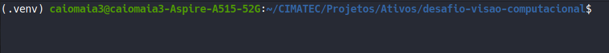
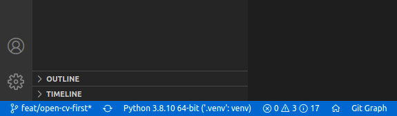

# Desafio de Visão Computacional
repo-name: **desafio-visao-computacional**

## Objetivo

Este repositório tem o objetivo de armazenar a solução do desafio de visão computacional proposto no Centro de Competência em Robótica do SENAI CIMATEC.

## Desafio

O desafio consiste em realizar transformações em determinada imagem, de modo que as cartas presentes nesta imagem sejam apresentadas na forma retangular e sem oclusão.


## Material de Apoio

- [Link do Minicurso do RoSA](https://github.com/Brazilian-Institute-of-Robotics/bir-mini-robotic-vision/tree/presentation)
- [Google Coolab do Mini-curso](https://colab.research.google.com/drive/1ozEWpFhsqHC6vI3QS-IxH6HThysonxKq)


## Preparação

Antes de trabalhar na solução é importante preparar um ambiente virtual, pois isto permite que a instalação de bibliotecas necessárias para aplicação não sejam instaladas no âmbito global do sistema.
O pacote escolhido para esta função é o [Venv](https://docs.python.org/3/library/venv.html) e sua instalação segue os seguintes passos:

### Instalação do Pip

Utilizarei o **Ubuntu 20.04** para este trabalho, que possui o Python 3 já pré-instalado. Deste modo só precisarei instalar o **pip**, que é um instalador de pacotes para o Python. A instalação ocorre ao executar os seguintes comandos no terminal:

```console
sudo apt update
sudo apt -y upgrade
sudo apt-get install python3-pip
```
### Instalação do Virtualenv e Criação do Ambiente

Utilizando o **pip** podemos instalar o venv como seguinte comando no terminal:

```console
pip3 install virtualenv
apt install python3.8-venv
```
No Unbuntu 20.04 o pacote do venv esta associado ao Python3.8, mas a versão pode ser diferente em outras distribuições.

Dentro da pasta que deseja criar o ambiente virtual execute o seguinte comando de terminal:
```console
python3 -m venv .venv
```
Dara ativar o ambiente basta utilizar o  seguinte comando:
```console
source .venv/bin/activate
```
Se tudo ocorreu bem, deverá aparecer o nome do ambiente, (.venv) antes do nome do usuário.



Para finalizar o processo instalarei uma extensão do VS Code que ativa automaticamente o ambiente no ambiente de desenvolvimento. Esta extensão é [Python Auto Venv](https://marketplace.visualstudio.com/items?itemName=whinarn.python-auto-venv) após instalar e reiniciar o VS Code o ambiente virtual será ativado automaticamente. Na interface do VS Code aparecerá versão do python e o nome do ambiente no canto inferior esquerdo.




## Instalação de Pacotes no Ambiente

Antes de utilizar funções básicas do OpenCV será necessário instalar alguns pacotes no ambiente virtual. Estes são: [numpy](https://numpy.org/), uma biblioteca numérica, [scikit-image](https://scikit-image.org/), para utilizar imagens da internet, e [opencv](https://opencv.org/). Nesta instalação será utilizada novamente o pip, mas agora no **ambiente virtual**. Portanto execute:

```console
python -m pip install -U pip
python -m pip install -U numpy
python -m pip install -U opencv-contrib-python
python -m pip install -U scikit-image
```

O flag -m aponta que sera utilizado um módulo de python. Já o flag -U faz com que o pacote seja atualizado, caso já tenha sido instalado.

Para testar a configuração do ambiente rode o seguinte script:
```console
python src/open-cv-first-touch.py
```
e a seguinte imagem deverá aparecer na tela. É possível que o script demore um pouco.


## Correção de Perspectiva


A principal funcionalidade para  desafio é a correção de perspectiva, portanto, o primeiro passo do nosso processo de solução será esta correção.

